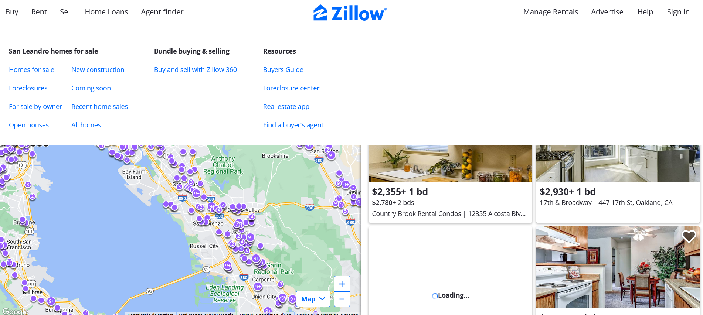
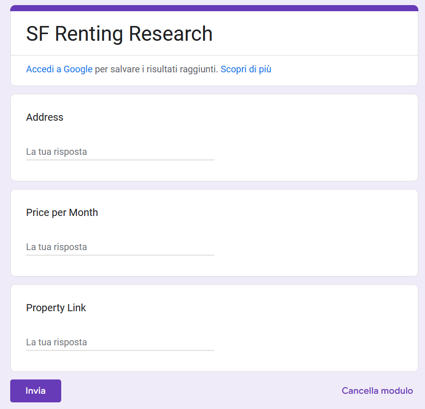
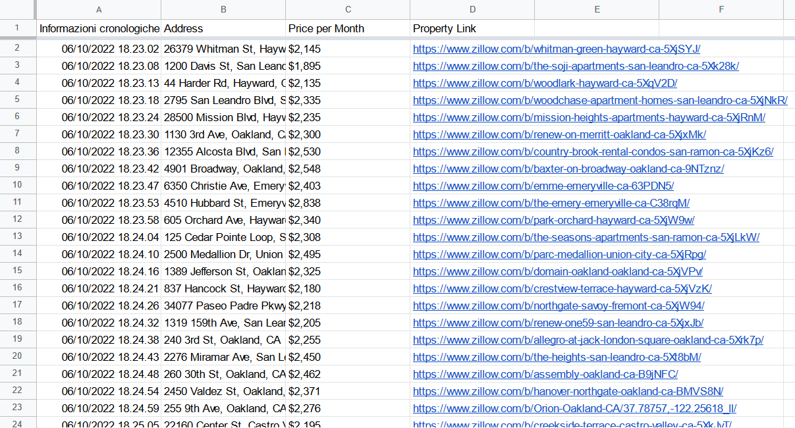

# Data Entry Job Automation
This Python web scraping project allows you to automatically scrape info from Zillow and create a 
nice spreadsheet using Google Form. 
**Libraries**: request, json, selenium, BeautifulSoup  

<table>
<tr></tr>
<tr>
  <td></td>
  <td></td>
</tr>
</table>
 
 The project is part of [The Complete Python Pro Bootcamp](https://www.udemy.com/course/100-days-of-code) in which I enrolled in 2022. 

### Credits
>To know more about The App Brewery's courses visit <a href="https://www.appbrewery.co/">App Brewery</a>!
